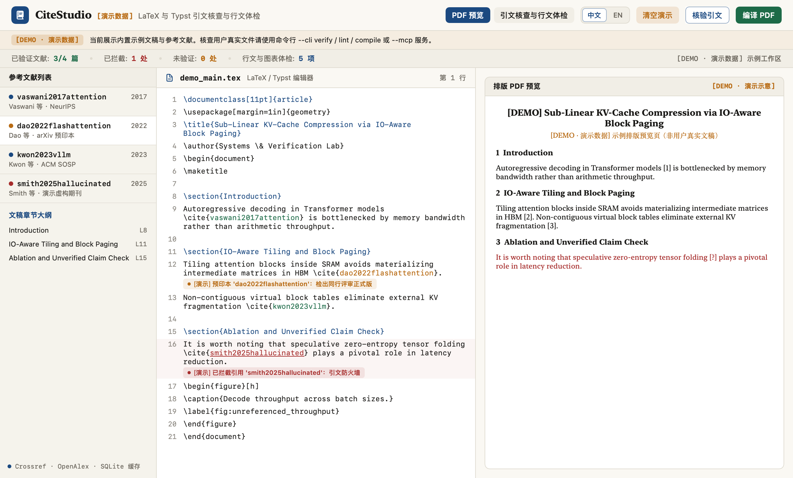
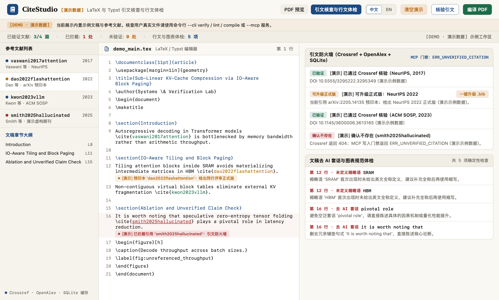

# CiteStudio

**[English](README.md)** | **简体中文**

**面向 LaTeX 与 Typst 的引文核查、撤稿筛查与学术行文体检工具（macOS 原生 Swift 6 + Crossref + OpenAlex + MCP）**

> **当前版本（v0.2.0）能力边界说明（请先阅读）**
> - **真实用户文件请通过 CLI 与 MCP 处理**：当前已支持命令行核验 `.bib` 参考文献（`--cli verify`）、清理本地核验缓存（`--cli clear-cache`）、检查 `.tex`/`.typ` 行文与图表引用（`--cli lint`）、调用外部编译器生成 PDF（`--cli compile`），以及通过 stdio MCP 服务（`--mcp`）拦截未通过核验的参考文献写入。
> - **桌面 GUI 当前限制**：不带 `--demo` 启动 `CiteStudio` 桌面窗口时，默认进入干净的**空白工作区**（`0` 字文稿、`0` 条参考文献、`0` 条诊断）。桌面端打开本地任意项目文件夹、编辑器与 PDF 之间的 SyncTeX 双向点击跳转、以及桌面端自动扫描 `pdfs/` 并在 PDF 预览中高亮证据坐标框均属于**计划中、当前尚未实现**的功能（详见文末[计划中（当前未实现）](#计划中当前未实现)）。如需查看界面排版，请点击工具栏 **“载入演示”** 按钮或传入 `--demo` 查看带 **`[DEMO · 演示数据]`** 标识的内置示例。

---

## 界面预览（`[DEMO · 演示数据]` 内置示例工作区）

> **截图说明（`[DEMO · 演示数据]`）**：以下截图均由 `CiteStudio --demo`（`--export-screenshots`）基于内置示例文稿与示例 `.bib` 渲染，顶部带有醒目的 **`[DEMO]` / `[DEMO · 演示数据]`** 标识，并非打开用户真实项目目录后的界面。

### 简体中文界面 (`--lang zh` · `[DEMO · 演示数据]`)

| 三栏示例工作区（`[DEMO · 演示数据]`） | 引文防火墙与行文体检抽屉（`[DEMO · 演示数据]`） |
| :---: | :---: |
|  |  |
| *`[DEMO · 演示数据]` 内置示例工作区（通过“载入演示”或 `--demo` 载入）。* | *`[DEMO · 演示数据]` 示例文献核验卡片与确定性去 AI 套话体检结果。* |

### 英文界面 (`--lang en` · `[DEMO]`)

| Three-Pane `[DEMO]` Sample Preview | Citation Firewall & Prose Lint Drawer (`[DEMO]`) |
| :---: | :---: |
|  |  |
| *`[DEMO]` Built-in sample workspace (`Load Demo` / `--demo`).* | *`[DEMO]` Sample citation statuses and deterministic prose lint cards.* |

---

## 当前已实现功能（M0）

### 1. 引文核查与三态查询结果严格分离（`ScholarTriangulator`）
通过 `URLSession` 查询 **Crossref** 与 **OpenAlex** 文献元数据，并将上游查询结果严格拆分为三种状态，绝不混同：

1. **已命中记录（`Verified` / `PreprintUpgrade` / `MetadataMismatch` / `Retracted`）**：
   - **DOI 元数据一致性比对**：按 DOI 取回记录后，同时核对**归一化标题相似度**（Jaccard 词项重合度）、**去除 LaTeX 重音符号后的第一作者姓氏**与**发表年份**（`|Δyear| ≤ 1`）。真实 DOI 若被配上了错误标题、错误作者或错误年份，会被判定为 **`MetadataMismatch`（元数据不符）**。
   - **撤稿识别（`Retracted`）**：同时检查 Crossref `update-to`、Crossref `updated-by`（含 `retraction` / `withdrawal` / `removal`）、Crossref `relation.is-retracted-by`、标题 `"RETRACTED:"` 前缀，以及 OpenAlex `is_retracted == true`。Wakefield 1998 与 Séralini 2012 等撤稿文献均会被识别为 **`Retracted`（已撤稿）**。
   - **预印本转正提示（`PreprintUpgrade`）**：当文稿引用 `arXiv` / `bioRxiv` / `medRxiv` 预印本且上游检出同行评审正式版时，给出正式版 BibTeX 替换建议。
2. **确认不存在（`GhostPaper`）**：
   - **仅当** Crossref 对所查 DOI 明确返回 HTTP `404`，或 Crossref 与 OpenAlex 标题检索均正常返回 HTTP `200` 且无匹配条目时，才判定为 **`GhostPaper`（确认不存在）**。
3. **查询失败 / 未验证（`Unverified` / `未验证`）**：
   - 断网、DNS/连接拒绝、请求超时、HTTP `429` 限流、HTTP `5xx` 服务端故障或响应解析失败，一律返回 **`Unverified`（未验证）**。
   - **`Unverified`（未验证）绝不写入本地 SQLite 缓存**，也绝不会误报成 `GhostPaper`。网络恢复后再次运行会立即重新请求上游。
   - SQLite 缓存条目带有明确的过期时间（TTL）：命中记录默认缓存 `7 天`，确认不存在记录默认采用更短的 `24 小时` TTL；读取时自动剔除过期缓存，也可随时执行 `--cli clear-cache` 手动清空。

> **当前已知局限**：无 DOI 的早期经典书籍或会议条目（例如 Knuth 1968 *The Art of Computer Programming*）目前仅按 Crossref/OpenAlex 标题首条命中比对，遇到包含相同常见词的后续期刊论文时可能报 `MetadataMismatch`。多候选综合打分与 Open Library 图书源回退计划在 M1 实现。

### 2. MCP 权威元数据写入门禁（`CiteStudio --mcp`）
通过标准输入/输出（`stdio`）运行 JSON-RPC 2.0 MCP 服务，提供 6 个工具：

| MCP 工具 | 实际行为 |
| :--- | :--- |
| `verify_citation` | 对单条 BibTeX 引用执行核验，返回结构化 JSON 诊断结果（`Verified`、`PreprintUpgrade`、`MetadataMismatch`、`Retracted`、`GhostPaper`、`Unverified`）。 |
| `add_verified_bibtex` | 写入 `.bib` 前先执行引文核验。遇到 `GhostPaper`、`MetadataMismatch`、`Retracted` 或 `Unverified` 时直接返回 `ERR_UNVERIFIED_CITATION` 并保持目标 `.bib` 原封不动；核验通过时**使用上游权威记录的 `title`、`author`、`year`、`journal`/`booktitle`、`doi` 生成规范 BibTeX 条目**（不盲信调用方传入的大小写或残缺字段），并对已存在的 `citeKey` 自动去重（`SKIPPED_DUPLICATE_KEY`）。 |
| `search_local_pdfs` | 基于 SQLite FTS5 BM25 在已建立的本地 PDF 索引库中检索原文片段与页码。 |
| `get_claim_evidence` | 根据论断句子与 `cite_key` 在已索引 PDF 段落中匹配最佳页码、矩形坐标与原文摘录。 |
| `audit_manuscript` | 对传入的 LaTeX / Typst 文本执行确定性去 AI 套话与图表引用检查（`WritingQualityLinter`）。 |
| `compile_pdf` | 调用本机安装的 `tectonic --synctex` 或 `typst compile` 编译指定 `.tex` / `.typ` 文件（文件不存在或未安装编译器时返回明确错误）。 |

### 3. 确定性学术行文与图表规范体检（`WritingQualityLinter`）
纯本地正则与行级扫描，不调用大模型：
- **英文 AI 高频套话检测（`anti-ai-vocab`）**：标记 *delve into*、*pivotal role*、*tapestry*、*underscore*、*it is worth noting that*、*comprehensive overview* 等空泛套话。
- **破折号密度检查（`polish-emdash-density`）**：提示单段过多使用 `---` / `—` 插入语。
- **未引用图表检测（`polish-uncited-float`）**：检查定义了 `\label{fig:...}` 或 `\label{tab:...}` 却从未在正文中通过 `\ref` / `\autoref` / `\cref` 引用的悬浮体。
- **未定义缩略语检查（`polish-undefined-acronym`）**：标记首次出现前未给出全称的大写缩略语（排除 `CPU`、`GPU`、`LLM`、`PDF`、`API`、`DOI`、`URL`、`SQL` 等通用词）。

---

## 快速开始与命令行用法

### 环境要求
- **macOS 14.0+**（Apple Silicon `arm64`）
- **Swift 6.0+**（Xcode 16+ 或 Command Line Tools，用于源码构建）
- 可选外部排版编译器（供 `--cli compile` 调用）：`brew install tectonic typst`

### 构建与测试
```bash
git clone https://github.com/zxu756/CiteStudio.git
cd CiteStudio

# 编译调试版可执行文件
swift build

# 运行 M0 里程碑单元测试与端到端验收套件（本地闭环替身，零外部网络请求）
./Scripts/test.sh milestone 0
```

### CLI 命令行工具（`--cli`）
所有 `--cli` 子命令与 MCP 服务共用同一套核验与体检引擎，并均支持 `--lang zh` / `--lang en` 与 `--cache-dir <目录>`：

```bash
# 1. 查看本机外部编译器路径与版本状态
.build/debug/CiteStudio --cli status

# 2. 逐条核验 .bib 文件中的全部参考文献
#    仅当全部条目均为 Verified（或 PreprintUpgrade）时退出码为 0；
#    若存在任何 GhostPaper、MetadataMismatch、Retracted 或 Unverified，均返回非 0 退出码。
.build/debug/CiteStudio --cli verify path/to/references.bib --lang zh
.build/debug/CiteStudio --cli verify path/to/references.bib --json

# 3. 清空本地 SQLite 引文核验缓存
.build/debug/CiteStudio --cli clear-cache --lang zh

# 4. 对 .tex 或 .typ 文稿运行确定性行文与图表体检
#    目标文件不存在时向 stderr 输出明确报错并以退出码 2 退出。
.build/debug/CiteStudio --cli lint path/to/main.tex --lang zh

# 5. 调用 Tectonic 或 Typst 编译 .tex / .typ 文件
.build/debug/CiteStudio --cli compile path/to/main.tex --lang zh

# 6. 启动 stdio MCP 服务器（供 Claude Code / Cursor / OpenCode 挂载）
.build/debug/CiteStudio --mcp

# 7. 启动桌面窗口（默认空白工作区；加 --demo 载入演示数据）
.build/debug/CiteStudio --lang zh
.build/debug/CiteStudio --demo --lang zh
```

### 环境变量说明
| 环境变量 | 作用 |
| :--- | :--- |
| `CITESTUDIO_CACHE_DIR` | 指定 `scholar_cache.sqlite` 与 `pdf_fts5.sqlite` 的存放目录（也可通过 `--cache-dir <路径>` 传入）。 |
| `CITESTUDIO_CROSSREF_BASE_URL` | 覆盖 Crossref API 基础地址（默认 `https://api.crossref.org`；供本地闭环测试使用）。 |
| `CITESTUDIO_OPENALEX_BASE_URL` | 覆盖 OpenAlex API 基础地址（默认 `https://api.openalex.org`；供本地闭环测试使用）。 |
| `CITESTUDIO_HTTP_TIMEOUT` | 单次 HTTP 请求超时秒数（默认 `12` 秒）。 |

---

## 计划中（当前未实现）

以下能力**不包含在当前 M0 版本中**，请勿将其视为现有功能：

- **桌面 GUI 打开与编辑本地项目目录（`M3`）**：通过菜单打开任意 `.tex` / `.typ` / `.bib` 文件夹、保存修改回磁盘及 `FSEvents` 文件变更自动刷新。
- **桌面 GUI 编辑器与 PDF 双向 SyncTeX 跳转（`M3`）**：在编辑器点击代码行跳转到 PDF 对应位置，或按住 `⌘` 点击 PDF 跳回源码行（当前 `SyncTeXMapper` 仅作为底层解析库存在，尚未接入界面交互）。
- **桌面 GUI 自动扫描 `pdfs/` 目录并渲染证据高亮框（`M2` / `M3`）**：打开项目时自动索引目录内 PDF 并在右侧面板绘制黄色坐标框（当前 `search_local_pdfs` 与 `get_claim_evidence` 仅对已写入 SQLite FTS5 的记录做检索匹配）。
- **多候选排序与无 DOI 经典书籍回退检索（`M1`）**：结合标题、作者、年份对多条候选记录综合打分并接入 Open Library，提升早期无 DOI 专著的识别准确率。

---

## 开源许可

本项目基于 [MIT License](LICENSE) 开源发布。
